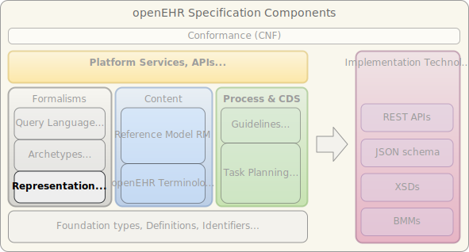

//
// ============================================ Asciidoc HEADER =============================================
//
include::{ref_dir}/docs/boilerplate/basic_style_settings.adoc[]

:keywords: language models, lang component
:description: openEHR Languages Component

include::{ref_dir}/docs/boilerplate/global_vars.adoc[]

//
// ============================================ Asciidoc PREAMBLE =============================================
//

image::{openehr_logo}["openEHR logo",align="center"]

:numbered!:
= Languages (LANG) Component - {lang_release}

// Use the following version for 'latest'
ifeval::["{lang_release}" == "latest"]
[.title-para]
{component_prs}[Open Issues^] | {component_roadmap}[Roadmap^] | {component_history}[Previous Releases^] 
endif::[]

// Use the following version for a named release
ifeval::["{lang_release}" != "latest"]
:lang_prs_fixed: {component_prs_fixed}{lang_release}/issues
:lang_crs_done: {component_crs_done}{lang_release}/changes
[.title-para]
{lang_prs_fixed}[Issues Fixed^] | {lang_crs_done}[Changes Implemented^] | {component_roadmap}[Roadmap^] | {component_history}[Change History^]
endif::[]

== Specifications

[cols="2,5", options="header"]
|===
|Specification |Description

|link:/releases/LANG/{lang_release}/odin.html[ODIN - Object Data Instance Notation]
|This is the JSON-like notation used to express various sections of ADL archetypes including description, terminology and annotations, and also BMM files.

|link:/releases/LANG/{lang_release}/bmm.html[BMM - Basic Meta-Model]
|BMM provides a human- and machine-readable / writable format for defining object models. It can be considered a much more compact and readable alternative to XMI.

|link:/releases/LANG/{lang_release}/bmm_persistence.html[P_BMM - BMM Persistence]
|A human-readable and machine-processable save format for BMM.

|link:/releases/LANG/{lang_release}/expression_language.html[EL - Expression Language]
|The openEHR Expression Language defines an extensible core model and syntax for specifying expressions for particular purposes elsewhere in openEHR, e.g. guidelines, rules etc.

|===

== Computable Expressions

[cols="2,5", options="header"]
|===
|Resource |Description

|link:/releases/LANG/{lang_release}/UML/openEHR_UML-LANG.mdzip[source files / XMI]
|UML file for openEHR Language model classes, as MagicDraw 18.5. Contains UML 2.5 standard XMI file.

|===

== Class Index

include::UML/class_index.adoc[leveloffset=+1]
